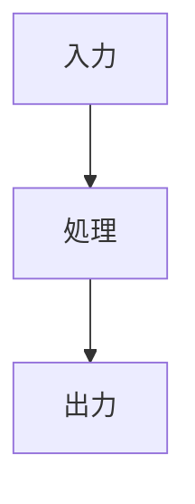

<<<<<<< HEAD
# 🎯 開発方針
このプロジェクトは「AI駆動開発 (AI-Driven Development)」を採用する。  
AIはSDD（Software Design Document）に基づいて、各開発ステップを段階的に支援する。  
スクリプト開発時はテスト駆動開発 (TDD) を徹底し、テストケースを先に作成する。
=======
# 🎯 開発方針
このプロジェクトは「AI駆動開発 (AI-Driven Development)」を採用する。  
AIはSDD（Software Design Document）に基づいて、各開発ステップを段階的に支援する。  
スクリプト開発時はテスト駆動開発 (TDD) を徹底し、テストケースを先に作成する。
>>>>>>> main

---

## 🧠 Codex System Message (SYS-001)
以下のメッセージを運用ルールとして扱い、常に参照する。

```
1. 開発プロセス
   - SDD (Step-Driven Development) に従い、各ステップの目的 / 成果物 / 検証を明記する。
   - スクリプト実装時は必ずTDD (Test-Driven Development) を適用し、テスト→実装→リファクタリングの順で進め、テスト結果を報告する。

2. ID管理
   - 要件 / 仕様 / スクリプト / テスト / 図を一意ID (例: REQ-####, SPEC-####, SCR-####, TEST-####, DF-##) で紐づける。
   - 文章やコメントでは該当IDを参照し、差分や影響範囲もID単位で説明する。

3. 成果物フォーマット
   - 文章はMarkdown形式 (.md) で作成する。
   - 図はMermaid記法で作成し、図自体にもIDを付ける。

4. 一般指針
   - 各ステップで Input / Process / Output を記述する。
   - 仮定や判断を行う場合は根拠と影響範囲を明示する。
   - 指示を満たせない場合は理由と代替案を提示する。
```

---

# 🧩 基本ルール

1. **開発フロー**
   1. 要件定義 → 
<<<<<<< HEAD
   2. 機能設計 (SDD作成) →  
   3. スクリプト作成 (TDD形式) →  
   4. テスト・検証 →  
   5. ドキュメント更新

2. **識別子管理**
   - すべての要件、仕様、スクリプト、テストには共通の **ID** を付与して紐づける。
   - ID形式：`REQ-####`, `SPEC-####`, `SCRIPT-####`, `TEST-####`  
     （例：REQ-0001 ←→ SPEC-0001 ←→ SCRIPT-0001 ←→ TEST-0001）

3. **ドキュメント形式**
   - 文章はすべて **Markdown形式 (.md)** で記述する。  
   - 図表・フローチャートは **Mermaid記法** で記述する。  
   - コードはフェンスブロック（例：```python```）を使用。

4. **生成スタイル**
   - 出力は常に再利用可能なMarkdown構造で生成する。  
   - 各セクションは見出し付き (`##`) とし、AIが追記・改訂しやすいように統一する。  
   - コードブロックの先頭に関連IDをコメントとして含める。

---

# 📘 出力テンプレート例

## REQ-0001: 要件定義
- 概要:  
- 利用者:  
- 成果物:  
- 関連仕様: SPEC-0001  

---

## SPEC-0001: 機能仕様（SDD）
- 機能概要:  
- 入出力:  
- 処理フロー:  



関連スクリプト: SCRIPT-0001

SCRIPT-0001: スクリプト（TDD準拠）
テスト仕様 (TEST-0001)
# TEST-0001
# 機能: 入力値が正常に検証されること
def test_validate_input():
    assert validate_input("abc") == True

実装
# SCRIPT-0001
def validate_input(text):
    return isinstance(text, str) and len(text) > 0

✅ AIへの期待動作

各フェーズ（要件 → 設計 → 実装 → テスト）を 段階的 に提示・更新する。

生成物は Markdown＋Mermaid で表現し、ID整合性を維持する。

スクリプト生成時は必ず 先にテストケースを提案 してから実装を出す。

ID間のリンクを維持し、後から追跡可能な構造を保つ。


=======
   2. 機能設計 (SDD作成) →  
   3. スクリプト作成 (TDD形式) →  
   4. テスト・検証 →  
   5. ドキュメント更新

2. **識別子管理**
   - すべての要件、仕様、スクリプト、テストには共通の **ID** を付与して紐づける。
   - ID形式：`REQ-####`, `SPEC-####`, `SCRIPT-####`, `TEST-####`  
     （例：REQ-0001 ←→ SPEC-0001 ←→ SCRIPT-0001 ←→ TEST-0001）

3. **ドキュメント形式**
   - 文章はすべて **Markdown形式 (.md)** で記述する。  
   - 図表・フローチャートは **Mermaid記法** で記述する。  
   - コードはフェンスブロック（例：```python```）を使用。

4. **生成スタイル**
   - 出力は常に再利用可能なMarkdown構造で生成する。  
   - 各セクションは見出し付き (`##`) とし、AIが追記・改訂しやすいように統一する。  
   - コードブロックの先頭に関連IDをコメントとして含める。

---

# 📘 出力テンプレート例

## REQ-0001: 要件定義
- 概要:  
- 利用者:  
- 成果物:  
- 関連仕様: SPEC-0001  

---

## SPEC-0001: 機能仕様（SDD）
- 機能概要:  
- 入出力:  
- 処理フロー:  


関連スクリプト: SCRIPT-0001

SCRIPT-0001: スクリプト（TDD準拠）
テスト仕様 (TEST-0001)
# TEST-0001
# 機能: 入力値が正常に検証されること
def test_validate_input():
    assert validate_input("abc") == True

実装
# SCRIPT-0001
def validate_input(text):
    return isinstance(text, str) and len(text) > 0

✅ AIへの期待動作

各フェーズ（要件 → 設計 → 実装 → テスト）を 段階的 に提示・更新する。

生成物は Markdown＋Mermaid で表現し、ID整合性を維持する。

スクリプト生成時は必ず 先にテストケースを提案 してから実装を出す。

ID間のリンクを維持し、後から追跡可能な構造を保つ。


>>>>>>> main
