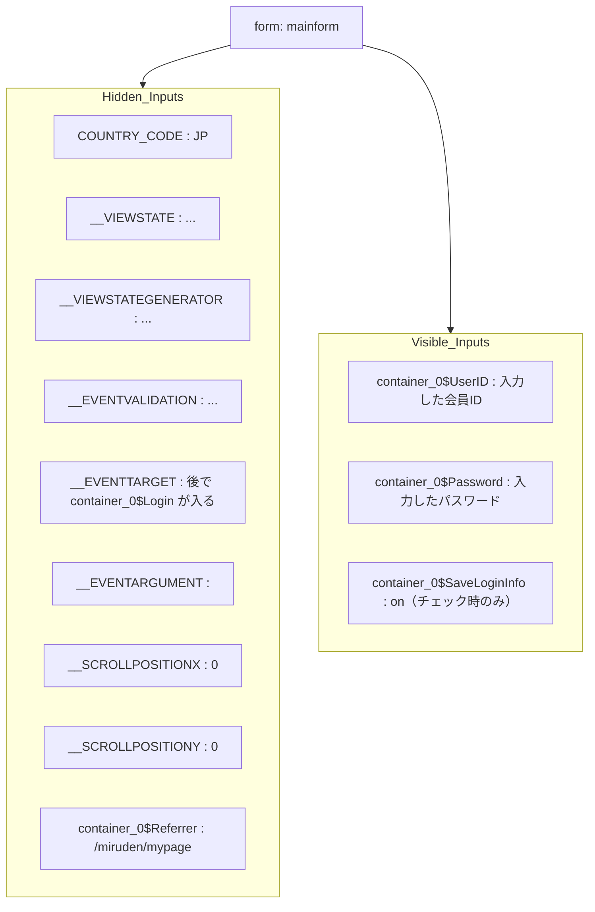
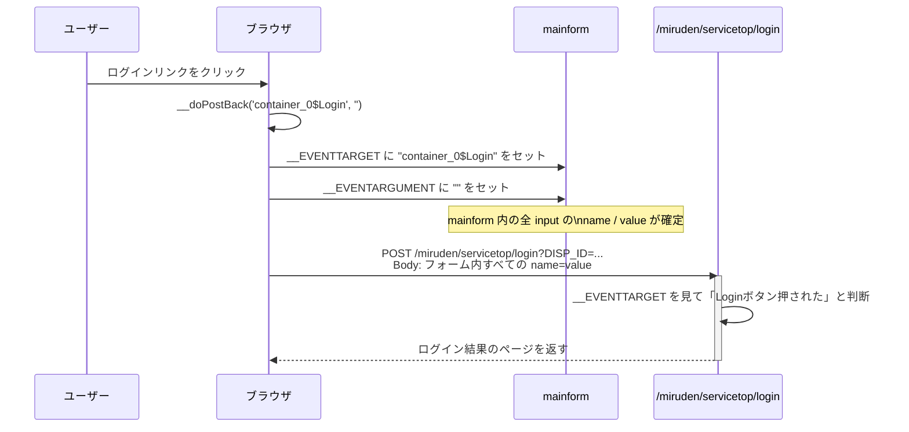

mainform の中身ってどうなってるの？


クリック → POST になる流れ


じゃあ POST body はどうなるのか

```mermaid
COUNTRY_CODE=JP
&__EVENTTARGET=container_0%24Login
&__EVENTARGUMENT=
&__VIEWSTATE=（hiddenから拾った長い文字列）
&__VIEWSTATEGENERATOR=B786C0CE
&__EVENTVALIDATION=（これもhiddenの長い文字列）
&__SCROLLPOSITIONX=0
&__SCROLLPOSITIONY=0
&container_0%24UserID=あなたの会員ID
&container_0%24Password=あなたのパスワード
&container_0%24SaveLoginInfo=on   （チェック時だけ）
&container_0%24Referrer=%2Fmiruden%2Fmypage
```


今の段階でこんなふうにイメージできていればバッチリです：

mainform は「POST される key/value 候補の 倉庫」

__doPostBack は「その倉庫の中の __EVENTTARGET だけこっそり書き換えてから submit する関数」

最終的に 倉庫の中身全部（name付きinput）の snapshot が HTTP body になる