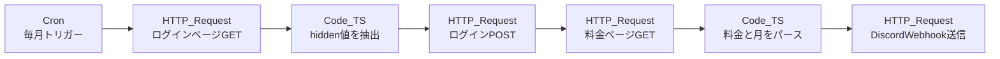
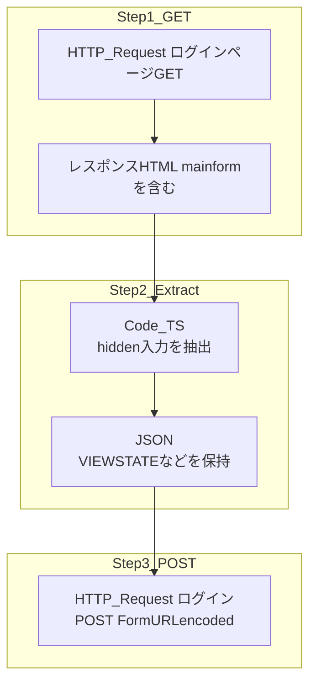
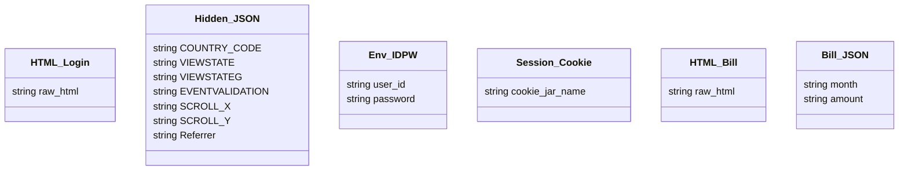
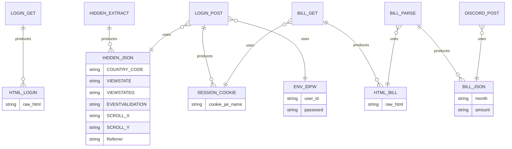

```mermaid
graph LR
    C[Cron<br/>毎月トリガー] --> G[HTTP_Request<br/>ログインページGET]
    G --> H[Code_TS<br/>hidden値を抽出]
    H --> P[HTTP_Request<br/>ログインPOST]
    P --> B[HTTP_Request<br/>料金ページGET]
    B --> E[Code_TS<br/>料金と月をパース]
    E --> D[HTTP_Request<br/>DiscordWebhook送信]
```

HTTP_Request ログインページGET

```mermaid
graph TD
    subgraph Step1_GET
        G1[HTTP_Request ログインページGET]
        G2[レスポンスHTML mainformを含む]
        G1 --> G2
    end

    subgraph Step2_Extract
        G2 --> C1[Code_TS<br/>hidden入力を抽出]
        C1 --> C2[JSON<br/>VIEWSTATEなどを保持]
    end

    subgraph Step3_POST
        C2 --> P1[HTTP_Request ログインPOST FormURLencoded]
    end

```

各ステップで扱う「データオブジェクト」だけを整理（classDiagram）

```mermaid
classDiagram
    class HTML_Login {
        string raw_html
    }

    class Hidden_JSON {
        string COUNTRY_CODE
        string VIEWSTATE
        string VIEWSTATEG
        string EVENTVALIDATION
        string SCROLL_X
        string SCROLL_Y
        string Referrer
    }

    class Env_IDPW {
        string user_id
        string password
    }

    class Session_Cookie {
        string cookie_jar_name
    }

    class HTML_Bill {
        string raw_html
    }

    class Bill_JSON {
        string month
        string amount
    }

```

「プロセス」と「データ」の関係を ER 図っぽく（erDiagram）

```mermaid
erDiagram
    HTML_LOGIN {
        string raw_html
    }

    HIDDEN_JSON {
        string COUNTRY_CODE
        string VIEWSTATE
        string VIEWSTATEG
        string EVENTVALIDATION
        string SCROLL_X
        string SCROLL_Y
        string Referrer
    }

    ENV_IDPW {
        string user_id
        string password
    }

    SESSION_COOKIE {
        string cookie_jar_name
    }

    HTML_BILL {
        string raw_html
    }

    BILL_JSON {
        string month
        string amount
    }

    LOGIN_GET ||--o{ HTML_LOGIN : produces
    HIDDEN_EXTRACT ||--o{ HIDDEN_JSON : produces
    LOGIN_POST ||--o{ SESSION_COOKIE : produces
    BILL_GET ||--o{ HTML_BILL : produces
    BILL_PARSE ||--o{ BILL_JSON : produces

    LOGIN_POST }o--|| HIDDEN_JSON : uses
    LOGIN_POST }o--|| ENV_IDPW : uses
    BILL_GET }o--|| SESSION_COOKIE : uses
    BILL_PARSE }o--|| HTML_BILL : uses
    DISCORD_POST }o--|| BILL_JSON : uses

```