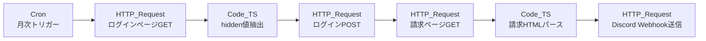
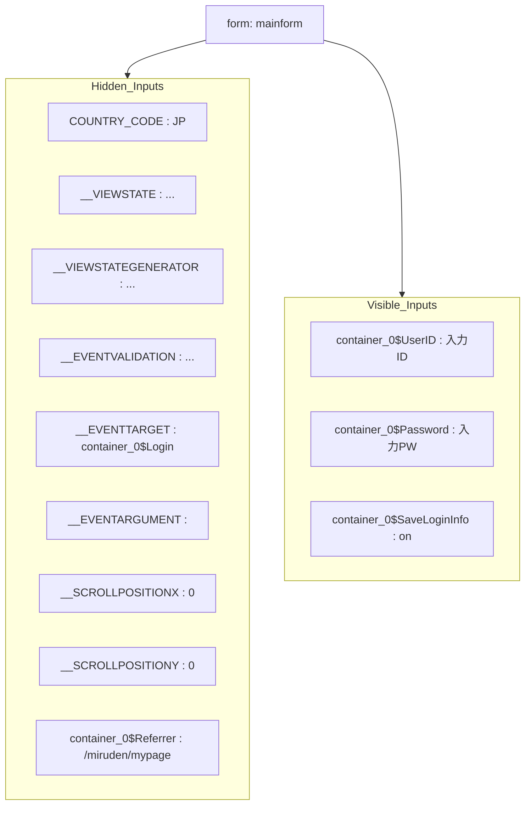
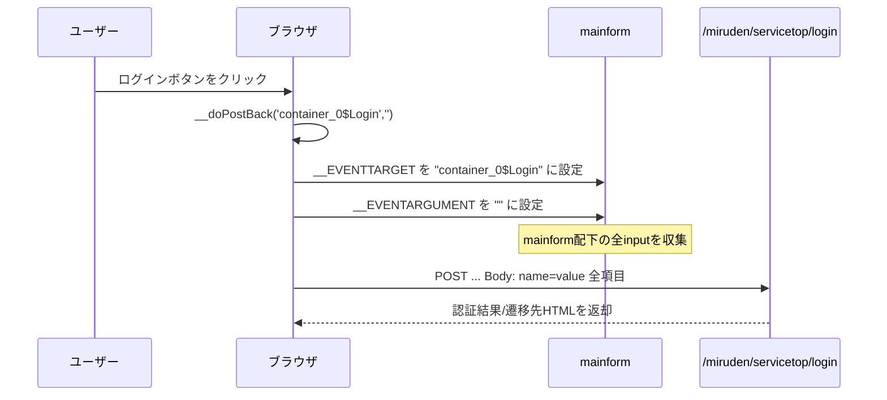
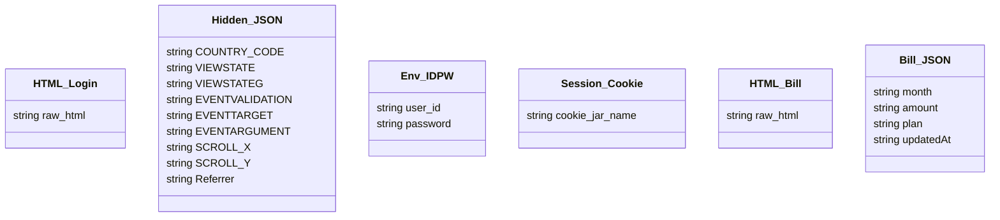
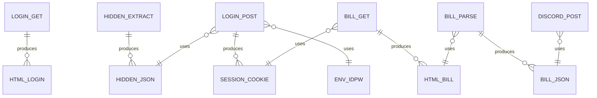

# n8n 月次電気料金通知フロー 要件定義書（DOC-ID: REQ-EL-001）

## 0. 図ID一覧
- **DF-01**: 全体処理フロー（Mermaid `graph LR`）
- **DF-02**: ログインフォーム要素とPOSTシーケンス（Mermaid `graph TD` + `sequenceDiagram`）
- **CD-01**: データオブジェクト構造（Mermaid `classDiagram`）
- **ER-01**: プロセスとデータの依存関係（Mermaid `erDiagram`）

## 1. 目的（OBJ-01）
毎月1回、電力会社のマイページから電気料金を取得し、Discordへ定型フォーマットで通知することで料金監視を自動化する（参照: DF-01）。

## 2. 利用者・通知先（USR-01）
- 主利用者: 電力料金の監視担当者
- 通知チャネル: 指定Discordチャンネル（Webhook URLはn8nクレデンシャルに格納）

## 3. 前提・制約（CON-01〜CON-03）
- CON-01: 対象サイトはASP.NETフォームで、`mainform`配下のhidden項目とdoPostBack機構を利用する（参照: DF-02）。
- CON-02: 認証情報（ID/PW）はn8nのCredentialsで暗号化保存し、環境変数から注入可能にする。
- CON-03: セッションはCookieベース。ログインPOSTで得たCookieを後続の請求取得リクエストに必ず付与する（参照: ER-01）。

## 4. システム概要（SYN-01）
n8nフローはCronトリガーを起点に、ログインページGET→hidden抽出→フォームPOST→請求ページGET→パース→Discord通知→失敗時アラートという直列処理で構成する。処理順序と責務はDF-01とER-01を基準とする。

## 5. 機能要件
- **FR-01 スケジューラ**  
  - Cronノードは毎月1日09:00 JSTに起動。タイムゾーンはUTC+9固定。失敗時は即時リトライ1回（参照: DF-01）。

- **FR-02 ログインページ取得**  
  - HTTP Requestノード `LOGIN_GET` は `GET /miruden/servicetop/login?...` を実行し、`HTML_Login.raw_html` として保存する（参照: DF-01, CD-01）。

- **FR-03 hidden値抽出**  
  - Functionノード `HIDDEN_EXTRACT` は `__VIEWSTATE` 等のhidden入力と `container_0$Referrer` を抽出し、JSON (`Hidden_JSON`) として後続へ渡す。抽出失敗時はエラー分岐（参照: DF-02, CD-01）。

- **FR-04 認証POST**  
  - HTTP Requestノード `LOGIN_POST` は `application/x-www-form-urlencoded` で hidden項目 + `Env_IDPW` を送信し、レスポンスCookieを `Session_Cookie` として保持する。`__EVENTTARGET=container_0$Login` を明示設定する（参照: DF-02, CD-01）。

- **FR-05 請求データ取得・整形**  
  - `BILL_GET` はログインCookieを付加して請求ページをGETし、`HTML_Bill` を `BILL_PARSE` でJSON化（`Bill_JSON`）。最低限 `month` と `amount` を抽出し、複数月の場合は配列で保持する（参照: DF-01, CD-01）。

- **FR-06 Discord通知**  
  - Discord Webhookノード `DISCORD_POST` はEmbed形式で、対象期間・料金・更新日時・実行IDを出力。Embed上限（6000文字）を超える場合はテキスト分割する（参照: DF-01）。

- **FR-07 エラーアラート**  
  - どの段階で失敗しても `Monitoring_Channel` へ障害通知を送る。通知には失敗ステップID（例: `FR-03`）とエラー概要を含める（参照: DF-01）。

## 6. 非機能要件
- **NFR-01 可用性**: CronはJST、実行時間は60秒以内を目標。n8nの実行履歴でリトライステータスを確認可能にする。
- **NFR-02 セキュリティ**: CredentialsストアにWebhook/ID/PWを保存し、ログ・Discordメッセージには平文を残さない（参照: CD-01）。
- **NFR-03 保守性**: 環境変数で対象URL、Webhook、通知テンプレートを切替可能。ID付き要件をWiki等で追跡。
- **NFR-04 監査性**: 各ノードで `executionId` をログ出力し、`Bill_JSON` を保管する期間・場所を運用チームで管理。

## 7. データ・インターフェース要件
- **DATA-01 HTML_Login**: 元HTMLをUTF-8で保持。次処理までの一時データとし、永続化不要（参照: CD-01）。
- **DATA-02 Hidden_JSON**: `COUNTRY_CODE`, `__VIEWSTATE`, `__EVENTVALIDATION`, `__EVENTTARGET`, `Referrer`, `SCROLL_X/Y` を含む（参照: DF-02, CD-01）。
- **DATA-03 Env_IDPW**: `user_id`, `password` を Credentials から読み出し、POSTボディ以外に露出させない。
- **DATA-04 Session_Cookie**: Cookie名は図ER-01の `cookie_jar_name` に従って再利用する。
- **DATA-05 Bill_JSON**: `{ "month": "YYYY-MM", "amount": number, "plan": string, "updatedAt": ISO8601 }` を最低限保持し、Discord通知およびログに利用する（参照: DF-01, ER-01）。

## 8. 運用・ログ要件
- **OPS-01 実行ログ**: n8n実行履歴と外部ログ（任意）に `executionId`, `FRステップID`, `結果` を記録。
- **OPS-02 手動トリガー**: テスト実行用の `manual` トリガーを用意し、Discordへは「テスト」ラベル付きで投稿する。
- **OPS-03 秘匿情報管理**: 認証情報・WebhookはID単位（例: `CRD-LOGIN-01`, `CRD-DISCORD-01`）で棚卸し。

## 9. Mermaid図

### 図ID: DF-01（全体処理フロー）

### 図ID: DF-02（ログインフォーム構造とPOST）

### 図ID: CD-01（データオブジェクト）

### 図ID: ER-01（プロセス×データ依存）

## 10. 図・要件IDのリンクと変更管理手順

- **CM-01 Gitブランチ運用**: `main` を基準に変更単位ごとにブランチ（例: `feature/req-fr05-update`）を作成し、`要件.md` や図ファイルを編集する。ブランチ名とコミットメッセージに対象ID（FR-xx/DF-xx等）を含めて追跡性を確保する。
- **CM-02 レビュー・マージ**: 変更はPull Requestで提出し、説明欄に変更理由・影響範囲・対象IDを列挙。レビューアは差分とMermaid図の整合性を確認してからマージ可否を判断する。
- **CM-03 バージョニング**: `REQ-EL-001` のリビジョン番号（例: `REQ-EL-001 v1.1`）を本文先頭に更新し、`CHANGELOG.md` などにコミットID・日付・概要を追記。タグ（例: `req-el-001-v1.1`）を打っておくと復元しやすい。
- **CM-04 参照整合性チェック**: 要件IDや図IDを追加/削除する場合、`git grep` でリポジトリ全体を検索し、未更新リンクが無いか確認。必要に応じて互換ガイドラインや移行手順を別節に追記する。
